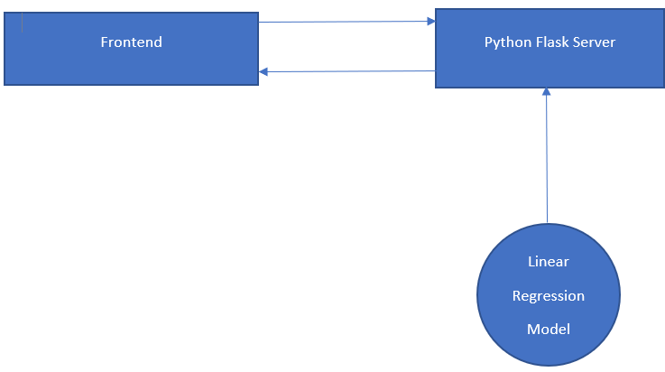
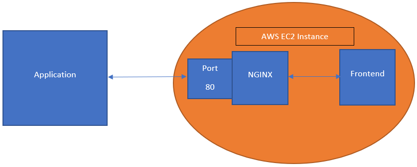

# Real Estate Price Prediction

In this project I have built a Real Estate Price Predictor using the fudamentals of Data Science and Machine Learning like Feature Engineering, Data Cleaning, One Hot Encoding, Outlier Detection, Dimensionality Reduction and GridSearchCV. The project also has a frontend, built using HTML, CSS and JS where inputs can be provided to predict the output.

## Technologies:

- Python as Programming Language

- Pandas for Data Cleaning

- matplotlib for Data Visualization

- sklearn for Model Building

- Flask for Backend Server

- HTML, CSS & JS for Frontend

## Architecture

#### Architecture for the application

#### Architecture for deployment

---

The dataset used in this project is from Kaggle which is the [Bengaluru House Price Data](https://www.kaggle.com/amitabhajoy/bengaluru-house-price-data).

---
